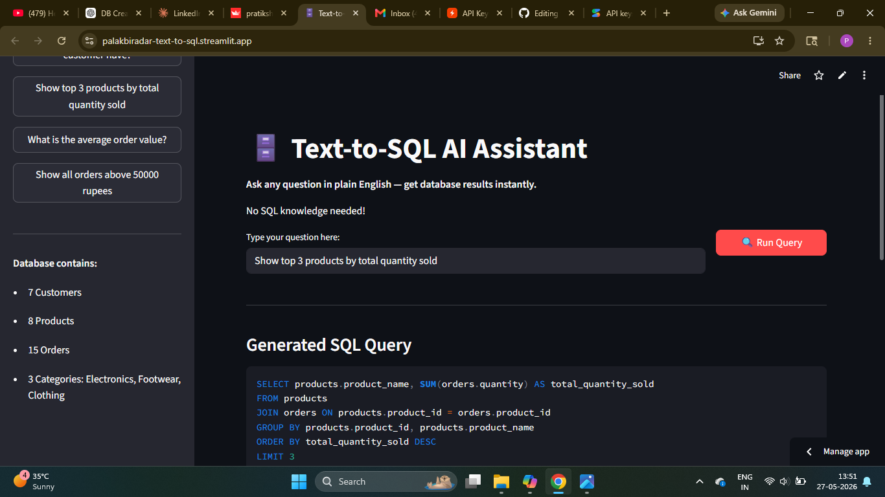

# 📄 RAG PDF Chatbot — Chat With Any Document

> Upload any PDF and get instant, accurate, source-cited answers using AI.


---

## 🌐 Live Demo
👉 https://rag-pdf-chatbot-ehjba5yqihuogckhwxltx4.streamlit.app

---

## 📌 Problem Statement
Reading large PDF documents — research papers, manuals, books — 
takes hours. Finding specific information means scrolling through 
hundreds of pages manually.

RAG PDF Chatbot solves this by letting you upload any PDF and ask 
questions in plain English — getting instant, accurate answers with 
exact source citations in seconds.

---

## ✨ Features
- ✅ Upload any PDF document
- ✅ Retrieval-Augmented Generation (RAG) pipeline
- ✅ Ultra-fast answers using Groq API (LLaMA 3.3 70B)
- ✅ Source citations shown for every answer
- ✅ Zero hallucination via grounded prompting
- ✅ Semantic vector search using ChromaDB
- ✅ HuggingFace embeddings for accurate retrieval
- ✅ Clean conversational chat interface
- ✅ Live Streamlit deployment

---

## 🧠 How RAG Works
PDF Upload → Text Extraction → Chunk Splitting
↓
HuggingFace Embeddings
↓
ChromaDB Vector Storage
↓
User Question → Semantic Search → Relevant Chunks
↓
Groq LLM (LLaMA 3.3 70B)
↓
Source-Cited Answer → User
---

## 🛠️ Tech Stack

| Layer | Technology |
|---|---|
| LLM | Groq API (llama-3.3-70b-versatile) |
| Framework | LangChain |
| Vector Database | ChromaDB |
| Embeddings | HuggingFace (all-MiniLM-L6-v2) |
| PDF Parsing | PyPDFLoader |
| UI | Streamlit |
| Language | Python 3.9+ |
| Deployment | Streamlit Cloud |

---

## 📂 Project Structure

RAG-PDF-Chatbot/
├── app.py              # Main Streamlit application
├── rag_engine.py       # RAG pipeline logic
├── requirements.txt    # Dependencies
├── .gitignore
├── images/             # Screenshots
│   ├── upload.png
│   ├── processed.png
│   └── answer.png
└── README.md
---

## 📸 Screenshots

### 1. Upload Your PDF


### 2. PDF Processed Successfully


### 3. Ask Questions & Get Source-Cited Answers


## ⚙️ Installation & Setup

### 1️⃣ Clone Repository
```bash
git clone https://github.com/pratikshabiradar19/RAG-PDF-Chatbot.git
cd RAG-PDF-Chatbot
```

### 2️⃣ Create Virtual Environment
```bash
python -m venv venv
venv\Scripts\activate
```

### 3️⃣ Install Dependencies
```bash
pip install -r requirements.txt
```

### 4️⃣ Configure API Key
Create a `.env` file in the project root:

Get your free Groq API key at 👉 https://console.groq.com/keys

### 5️⃣ Run Application
```bash
streamlit run app.py
```

---

## 💡 Example Questions You Can Ask

| Document Type | Example Question |
|---|---|
| Research Paper | "What is the main conclusion of this paper?" |
| User Manual | "How do I reset the device to factory settings?" |
| Legal Document | "What are the termination clauses?" |
| Book | "Summarize chapter 3" |

---

## 🔥 Key Highlights
- Zero hallucination — answers grounded in your document only
- Source citations shown so you can verify every answer
- Groq API delivers ultra-fast LLM responses
- ChromaDB enables accurate semantic vector search
- Works with any PDF — books, papers, manuals, reports
- HuggingFace embeddings for high quality retrieval

---

## 🚀 Future Improvements
- [ ] Multi-PDF support
- [ ] Chat history and memory
- [ ] Support for Word and Excel files
- [ ] Table and image extraction from PDFs
- [ ] FastAPI backend
- [ ] Docker deployment
- [ ] User authentication

---

## 📦 Requirements

streamlit
groq
langchain
langchain-community
chromadb
sentence-transformers
pypdf
python-dotenv

---

## 👩‍💻 Author
**Pratiksha Biradar**
Gen AI Developer | AI Engineer | Data Scientist

- 🐙 GitHub: https://github.com/pratikshabiradar19
- 💼 LinkedIn: https://www.linkedin.com/in/pratiksha-biradar-979b98315
- 📧 Email: biradarpratiksha296@gmail.com

---

## ⭐ Support
If you found this project useful, give it a star ⭐ and share it!

---

*Built with ❤️ using LangChain + Groq API + ChromaDB + Streamlit*
